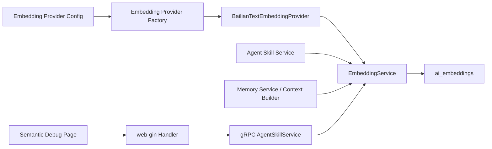
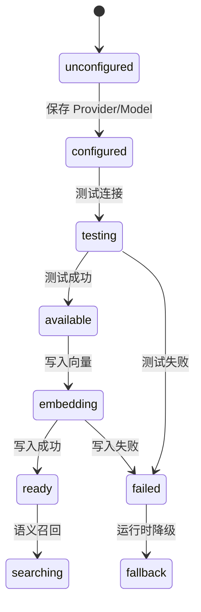

# 阿里云百炼 Embedding Provider 接入 SDD

## 1. 设计目标

本设计目标是在当前 Smart Recruit 架构中接入阿里云百炼 MaaS 原生 HTTP Embedding API，默认模型为 `text-embedding-v4`，为 Agent Skill 与 AI Memory 提供生产可用的向量化写入和语义召回能力。

设计原则：

- 已确认采用独立 `embedding_providers` / `embedding_models` 表。
- 已确认阿里云百炼调用以用户提供的 MaaS 原生 HTTP curl 为准。
- 管理端配置页不纳入本期实现，但接口、数据模型和文档保留后续扩展能力。
- 已确认本期直接采用 MQ consumer 执行 embedding 写入，不使用 best-effort goroutine 作为交付方案。

- 不破坏现有 Agent Skill、Memory 和语义调试接口。
- Provider 可配置、可测试、可降级。
- 外部 API 调用具备超时、重试、并发控制和可观测性。
- 敏感信息加密存储，业务文本不进入日志。
- 支持后续扩展其他 embedding provider。

## 2. 现状代码分析

### 页面

- `hr-frontend/src/views/hr/admin/SemanticRetrievalDebugView.vue`
  - 独立语义召回调试页。
  - 当前调用 `debugSemanticRetrieval`。
  - 已展示 query、参数、概览、Skill / Memory 结果和 fallback 状态。

- `hr-frontend/src/views/hr/admin/AgentSkillManageView.vue`
  - Agent Skill 管理页。
  - 创建/编辑 Skill 时维护 `semantic_tags`、`required_capabilities`、`output_schema` 等字段。
  - 未来需要在 Skill 创建、更新、版本激活后触发 embedding 写入。

### API

- `hr-frontend/src/api/agentSkill.ts`
  - `debugSemanticRetrieval(params)` 调用 `/api/v1/hr/admin/agent-skills/semantic-debug`。

### 类型定义

- `hr-frontend/src/types/agentSkill.ts`
  - `SemanticRetrievalDebugParams`
  - `SemanticRetrievalDebugResult`
  - `SemanticSkillDebugItem`
  - `SemanticMemoryDebugItem`

### HTTP Handler

- `web-gin-service/handler/hr/agent_skill.go`
  - `DebugSemanticRetrieval` 从 query 参数读取 `query`、`agent_type`、`job_id`、`application_id`、`limit`。
  - 调用 gRPC `AgentSkill.DebugSemanticRetrieval`。

### gRPC 聚合 Server

- `logic-grpc-service/server/server.go`
  - 当前已补充 `DebugSemanticRetrieval` 转发方法。
  - 转发至 `s.svc.AgentSkill.DebugSemanticRetrieval`。

### 服务层

- `logic-grpc-service/service/agent_skill_service.go`
  - `DebugSemanticRetrieval` 聚合 Skill 召回和 Memory 召回调试结果。
  - `semanticDebugSkillScores` 调用 `EmbeddingService.Search`。
  - `semanticDebugMemories` 通过 `AgentContextBuilder` 获取 memory 召回结果。
  - Provider 不可用时返回 fallback reason。

- `logic-grpc-service/service/embedding_service.go`
  - 定义 `EmbeddingProvider` 接口。
  - 当前有 `UnavailableEmbeddingProvider`。
  - `EmbedObject` 支持存储向量。
  - `Search` 支持 query vector 生成、候选加载和余弦排序。

- `logic-grpc-service/service/services.go`
  - 当前初始化：`NewEmbeddingService(repository.NewAIEmbeddingRepo(db), UnavailableEmbeddingProvider{})`。
  - 需要改为根据配置加载真实 provider。

- `logic-grpc-service/service/agent_context.go`
  - `AgentContextBuilder` 支持注入 `EmbeddingService`。
  - Memory 召回可使用 semantic scores。

### Repository / Model

- `logic-grpc-service/model/model.go`
  - `AIEmbedding` 对应 `ai_embeddings` 表。

- `logic-grpc-service/repository/ai_embedding_repo.go`
  - `Upsert`
  - `GetByObject`
  - `ListCandidates`

- `logic-grpc-service/migrations/000044_add_ai_embeddings.sql`
  - 已创建 `ai_embeddings` 表。

### 配置项

- `logic-grpc-service/config/config.go`
  - 当前无 `Embedding` 配置段。
  - 需要新增 `Embedding` 配置。

## 3. 总体设计



核心设计：

1. 新增 `embedding_providers` 与 `embedding_models` 保存百炼配置。
2. 新增 `BailianTextEmbeddingProvider` 实现现有 `EmbeddingProvider`。
3. 新增 Provider Factory，在服务启动时加载默认 `text-embedding-v4`。
4. Agent Skill 和 AI Memory 写入时生成 embedding。
5. 语义召回调试页展示真实 provider/model 状态。
6. Provider 失败时保留规则召回降级。

## 4. 模块设计

### 页面层

#### `SemanticRetrievalDebugView.vue`

- 职责：展示语义召回测试输入、参数、状态概览和结果对比。
- 输入：query、agent_type、job_id、application_id、limit。
- 输出：Skill / Memory 召回结果。
- 依赖：`debugSemanticRetrieval` API。
- 修改：增强展示 provider/model、embedding_dim、candidate_count、query_embedding_latency_ms。

#### `AgentSkillManageView.vue`

- 职责：管理 Agent Skill。
- 输入：Skill 元数据、版本内容。
- 输出：Skill 保存/激活。
- 依赖：Agent Skill API。
- 修改：不直接调用 embedding API；由后端在保存或激活后触发 embedding 写入。

### API 服务层

#### `hr-frontend/src/api/agentSkill.ts`

- 职责：封装语义召回调试 API。
- 修改：如果后端 response 新增 provider/model 字段，类型补充但保持向后兼容。

### HTTP / gRPC 层

#### `web-gin-service/handler/hr/agent_skill.go`

- 职责：HTTP 参数解析与 gRPC 转发。
- 修改：透传新增 debug response 字段。

#### `logic-grpc-service/server/server.go`

- 职责：gRPC 聚合 server 转发。
- 修改：已具备 `DebugSemanticRetrieval` 转发；后续无需新增业务逻辑。

### Provider 配置模块

新增文件建议：

- `logic-grpc-service/model/embedding_config.go` 或扩展 `model/model.go`
- `logic-grpc-service/repository/embedding_provider_repo.go`
- `logic-grpc-service/repository/embedding_model_repo.go`
- `logic-grpc-service/service/embedding_config_service.go`

职责：
- 管理 provider/model 配置。
- 读取默认模型。
- 测试连接。
- 更新 last_test_status。

### Provider 实现模块

新增文件建议：

- `logic-grpc-service/service/embedding_provider_bailian.go`
- `logic-grpc-service/service/embedding_provider_factory.go`

职责：
- 构造百炼 HTTP 请求。
- 解析响应。
- 处理错误、重试、超时。
- 返回 `EmbeddingVector`。

### 数据适配层

新增文件建议：

- `logic-grpc-service/service/embedding_text_builder.go`

职责：
- 将 Agent Skill / AI Memory 转换为 embedding text。
- 避免各业务服务重复拼接文本。

### 持久化层

使用现有：

- `repository.AIEmbeddingRepo`

新增：

- `EmbeddingProviderRepo`
- `EmbeddingModelRepo`

## 5. 数据结构设计

### Go Config

```go
type Config struct {
    Embedding struct {
        Enabled                 *bool    `yaml:"enabled"`
        DefaultModelID          int64    `yaml:"default_model_id"`
        FallbackToRuleRetrieval *bool    `yaml:"fallback_to_rule_retrieval"`
        RequestTimeout          Duration `yaml:"request_timeout"`
        MaxConcurrency          int      `yaml:"max_concurrency"`
        SlowRequestThreshold    Duration `yaml:"slow_request_threshold"`
    } `yaml:"embedding"`
}
```

默认值：

- enabled=true
- fallback_to_rule_retrieval=true
- request_timeout=30s
- max_concurrency=8
- slow_request_threshold=2s

### Model

```go
type EmbeddingProviderConfig struct {
    ID              int64
    Name            string
    ProviderType    string
    Endpoint        string
    APIKeyEncrypted string
    ExtraHeaders    *string
    IsEnabled       int32
    CreatedAt       time.Time
    UpdatedAt       time.Time
}
```

```go
type EmbeddingModelConfig struct {
    ID              int64
    ProviderID      int64
    ModelName       string
    DisplayName     string
    EmbeddingDim    int32
    InputTokenLimit int32
    BatchSize       int32
    TimeoutSeconds  int32
    MaxRetries      int32
    IsEnabled       int32
    IsDefault       int32
    LastTestStatus  string
    LastTestError   string
    LastTestAt      *time.Time
    CreatedAt       time.Time
    UpdatedAt       time.Time
}
```

### TypeScript Response 扩展

```ts
export interface SemanticRetrievalDebugResult {
  embedding_available: boolean
  fallback_reason?: string
  embedding_provider?: string
  embedding_model?: string
  embedding_dim?: number
  candidate_count?: number
  query_embedding_latency_ms?: number
  skills: SemanticSkillDebugItem[]
  memories: SemanticMemoryDebugItem[]
}
```

## 6. 接口设计

### 6.1 百炼 HTTP API

- 接口名称：Bailian Text Embedding API
- Method：POST
- URL：配置中的 endpoint
- Header：
  - Authorization: Bearer `{api_key}`
  - Content-Type: application/json
- 请求：

```json
{
  "model": "text-embedding-v4",
  "input": {
    "texts": ["待向量化文本"]
  }
}
```

- 响应：以测试连接实际格式为准，Provider 层兼容 `output.embeddings` 和 `data`。
- 超时：默认 30s。
- 重试：429、5xx、timeout 最多 2 次。

### 6.2 管理端配置接口

待新增 gRPC/HTTP：

- `ListEmbeddingProviders`
- `CreateEmbeddingProvider`
- `UpdateEmbeddingProvider`
- `ListEmbeddingModels`
- `CreateEmbeddingModel`
- `UpdateEmbeddingModel`
- `SetDefaultEmbeddingModel`
- `TestEmbeddingModel`
- `BackfillEmbeddings`

错误码：

- 400：参数错误
- 401/403：权限不足
- 404：provider/model 不存在
- 409：默认模型冲突
- 500：服务内部错误

## 7. 状态流转设计



页面状态：

- idle：未运行
- loading：运行中
- success：召回成功
- empty：无 Skill/Memory 命中
- fallback：Provider 不可用，规则召回
- error：接口调用失败

## 8. 关键流程设计

### 初始化流程

1. logic 服务启动。
2. 读取 embedding config。
3. 查询默认 embedding model。
4. 查询 provider。
5. 解密 API key。
6. 构造 `BailianTextEmbeddingProvider`。
7. 注入 `EmbeddingService`。
8. 失败时注入 `UnavailableEmbeddingProvider`。

### 用户操作流程

1. 管理员配置 provider/model。
2. 点击测试连接。
3. 成功后设为默认模型。
4. 执行 backfill 或等待业务事件触发写入。
5. 在语义召回调试页输入 query。
6. 查看召回结果。

### 数据提交流程

- Provider API Key 提交后立即加密。
- Model 保存时校验 provider 可用性。
- 设置默认模型时清理其他默认标记。

### 写入机制选型

- Best-effort goroutine：不作为本期交付方案，仅作为被否决的备选方案记录；原因是进程重启可能丢任务，重试、限速和观测能力不足。
- MQ consumer：本期确认采用。需要事件发布、队列、consumer、重试和死信处理；优点是可靠、可重放、可限速、可观测，适合企业生产环境长期维护。
- Service 层发布事件：本期确认采用。Agent Skill / AI Memory 的创建、更新、激活等业务 Service 在主数据保存成功后发布 `embedding.upsert` 事件，不在 Repository 层隐式触发，避免持久化层混入业务语义。
- Outbox：不作为本期交付方案，作为后续可靠性增强方向保留；当异步事件规模扩大或需要更强事务一致性时，可演进为 DB Outbox + Worker 投递 MQ。
- 定时扫描 / Backfill：作为历史数据初始化和失败补偿能力，不作为实时写入主链路。
- 设计结论：Agent Skill 与 AI Memory 写入主链路采用 Service 层发布 MQ 事件；实际向量生成和 `ai_embeddings` 写入由 MQ consumer 完成。

### 错误处理流程

- Provider API 调用失败：返回 typed error。
- EmbeddingService 捕获错误并写入 failed/unavailable。
- DebugSemanticRetrieval 捕获错误并返回 fallback reason。

### 重置流程

- 调试页重置只清空页面状态，不修改后端配置。

### 回滚流程

- 将 `embedding.enabled=false`。
- 或删除/禁用默认 embedding model。
- 服务自动回退 `UnavailableEmbeddingProvider`。

## 9. 错误处理与降级策略

- 网络错误：重试后失败，记录 failed。
- 401/403：不重试，提示凭证错误。
- 429：重试，仍失败则降级。
- 5xx：重试，仍失败则降级。
- 空 vector：标记模型响应异常。
- 维度不一致：拒绝写入 ready。
- 权限不足：管理接口返回 403。
- 查询为空：HTTP handler 返回 400 或业务 code=400。
- 数据为空：页面显示空状态引导。

## 10. 日志与可观测性

### 用户操作日志

- 创建/更新 provider。
- 创建/更新 model。
- 设置默认模型。
- 测试连接。
- 触发 backfill。

### 接口请求日志

- provider_id
- model_id
- model_name
- request_id
- duration_ms
- status
- vector_dim

### 异常日志

- provider call failed
- decrypt api key failed
- dimension mismatch
- empty vector
- backfill failed item

### 关键状态变化日志

- default embedding model changed
- embedding provider fallback enabled
- backfill started / finished
- embedding object ready / failed

禁止记录：

- API key
- 完整 query 文本
- 完整简历文本
- 完整 Memory content
- 完整 SKILL.md

## 11. 安全与权限

- API Key 使用现有 AES-GCM 加密机制。
- 管理接口要求系统配置管理权限或等价管理员权限。
- Backfill 需要管理员权限。
- 输入 endpoint 需要校验 URL scheme 为 https。
- 前端不保存 API key 到 localStorage。
- 错误返回需要脱敏。
- 防止 XSS：调试页仅文本展示，不使用 `v-html`。

## 12. 兼容性影响

- `EmbeddingProvider` 接口保持不变。
- `EmbeddingService` 调用方式保持不变。
- `ai_embeddings` 表可继续使用，但可能需要扩展 status 枚举语义。
- `DebugSemanticRetrieval` 可向后兼容新增 response 字段。
- 对 Agent Skill 管理页无直接破坏性影响。
- 对 LLM Provider/Model 现有配置无直接修改，因采用独立 embedding provider/model 表。

公共模块影响：

- `config.Config` 新增 `Embedding` 段。
- `service.Services` 初始化流程修改。
- 新增 repository 和 service 模块。

## 13. 测试方案

### 单元测试

- `BailianTextEmbeddingProvider` 请求 body 正确。
- Authorization header 正确。
- 成功响应解析 `output.embeddings`。
- 兼容响应解析 `data`。
- 401/403 不重试。
- 429/5xx/timeout 重试。
- 空 vector 返回错误。
- 维度不一致返回错误。
- Provider factory 在配置缺失时返回 unavailable。

### 组件测试

- 语义召回调试页未运行状态。
- 快捷 query 点击填入输入框。
- Ctrl + Enter 触发运行。
- fallback reason 展示。
- provider/model 信息展示。

### 集成测试

- fake 百炼 HTTP server。
- 创建 provider/model。
- 测试连接成功并写入 embedding_dim。
- backfill agent_skill 写入 ready。
- DebugSemanticRetrieval 返回 `embedding_available=true`。

### 手工测试用例

1. 未配置 provider 时运行语义召回，页面显示规则回退。
2. 配置错误 API Key，测试连接失败且不泄漏 key。
3. 配置正确 provider/model，测试连接返回维度。
4. 创建 Agent Skill 并激活版本，检查 `ai_embeddings` 写入。
5. 执行 backfill，检查统计结果。
6. 停用默认 model，服务回退 unavailable。

### 回归测试范围

- Agent Skill 创建、编辑、版本激活。
- AI Memory 召回。
- 语义召回调试页。
- LLM Provider 现有管理功能。
- logic-grpc-service 启动。

## 14. 开发任务拆解

### TASK-001：新增数据库迁移

- 修改文件：`logic-grpc-service/migrations/xxxxx_add_embedding_provider_config.sql`
- 内容：新增 `embedding_providers`、`embedding_models`。
- 影响范围：数据库 schema。
- 验收方式：迁移执行成功，down migration 可回滚。

### TASK-002：新增 Model 与 Repository

- 修改文件：`logic-grpc-service/model/model.go` 或新增 model 文件；新增 repository 文件。
- 内容：定义 provider/model 结构和 CRUD。
- 影响范围：logic 服务持久化层。
- 验收方式：repository 单测通过。

### TASK-003：新增 Config 字段

- 修改文件：`logic-grpc-service/config/config.go`、配置样例。
- 内容：新增 `Embedding` 配置段和默认值。
- 影响范围：服务启动配置。
- 验收方式：无配置时可启动并降级。

### TASK-004：实现 Bailian Provider

- 修改文件：`logic-grpc-service/service/embedding_provider_bailian.go`
- 内容：实现 HTTP 调用、响应解析、错误分类、重试。
- 影响范围：Embedding provider 层。
- 验收方式：fake HTTP server 单测通过。

### TASK-005：实现 Provider Factory

- 修改文件：`logic-grpc-service/service/embedding_provider_factory.go`
- 内容：读取默认模型、解密 key、构造 provider。
- 影响范围：服务初始化。
- 验收方式：配置缺失/错误时降级，配置正确时返回真实 provider。

### TASK-006：接入 services.go

- 修改文件：`logic-grpc-service/service/services.go`
- 内容：替换硬编码 `UnavailableEmbeddingProvider{}`。
- 影响范围：全局 embedding 服务。
- 验收方式：启动日志显示 provider 状态。

### TASK-007：新增测试连接接口

- 修改文件：proto、logic service、web handler、前端 API。
- 内容：测试 embedding model 可用性并写入 last_test 字段。
- 影响范围：后端配置能力；管理端配置页面不在本期实现，但接口和文档应支持后续页面复用。
- 验收方式：成功返回维度和耗时，失败返回脱敏错误。

### TASK-008：Agent Skill embedding 写入

- 修改文件：`agent_skill_service.go` 或新增 embedding event publisher。
- 内容：Skill 创建/更新/激活后发布 embedding upsert 事件，由 MQ consumer 写入 embedding。
- 影响范围：Agent Skill 保存流程。
- 验收方式：保存 Skill 后生成 ready embedding。

### TASK-009：AI Memory embedding 写入

- 修改文件：AI Memory 创建/更新相关 Service 文件，具体文件需在实现前根据当前代码入口定位。
- 内容：Memory 创建成功、内容更新成功后，在 Service 层发布 `embedding.upsert` 事件，由 MQ consumer 写入 embedding；Repository 层不负责发布业务事件。
- 影响范围：AI Memory。
- 验收方式：Memory 创建后生成 ready embedding；Memory 内容更新后重新生成 embedding；非内容字段更新不重复触发 embedding。

### TASK-010：新增 Embedding MQ Consumer

- 修改文件：新增 embedding event publisher、consumer、消息类型定义和 RabbitMQ 绑定配置。
- 内容：消费 embedding upsert 事件，调用 `EmbeddingService.EmbedObject`，处理重试、限速和死信。
- 影响范围：异步任务处理、RabbitMQ 配置、Agent Skill / Memory 写入链路。
- 验收方式：发布事件后 consumer 能生成 `ai_embeddings` ready 记录；provider 失败进入重试或死信。

### TASK-011：Backfill 命令

- 修改文件：`logic-grpc-service/cmd/backfill-embeddings/main.go`
- 内容：批量生成历史对象 embedding。
- 影响范围：运维工具。
- 验收方式：dry-run 和实际执行统计正确。

### TASK-012：语义调试页增强

- 修改文件：`SemanticRetrievalDebugView.vue`、类型定义、API。
- 内容：展示 provider/model/维度/候选数量/耗时。
- 影响范围：HR 前端调试页面。
- 验收方式：provider 可用/不可用状态展示正确。

### TASK-013：补充测试

- 修改文件：各层 `*_test.go` 和前端测试。
- 内容：覆盖 provider、factory、repo、backfill、页面状态。
- 影响范围：测试套件。
- 验收方式：`go test ./...`、`pnpm --filter hr-frontend typecheck` 通过。

## 15. 风险与回滚方案

### 技术风险

- 百炼响应结构与用户提供的 curl 示例不一致。实现应以该 curl 的 endpoint 与 request body 为主，并通过测试连接确认实际 response。
- 向量维度变化导致历史向量不可混用。
- Backfill 触发 API 限流。
- 大量 vector JSON 存储影响 MySQL 体积和查询性能。

### 业务风险

- 召回排序变化影响 Agent Skill 选择结果。
- Provider 不稳定时调试结果波动。
- Memory embedding 涉及敏感文本，需要严格日志脱敏。

### 兼容性风险

- 新增配置表不应影响现有 LLM Provider。
- 新增 response 字段需保持前端兼容。

### 回滚方案

- 设置 `embedding.enabled=false`。
- 停用默认 embedding model。
- 服务自动回退 `UnavailableEmbeddingProvider`。
- 保留 `ai_embeddings` 数据，不影响规则召回。
- 如需数据库回滚，执行 down migration 删除配置表；现有 `ai_embeddings` 可保留。
