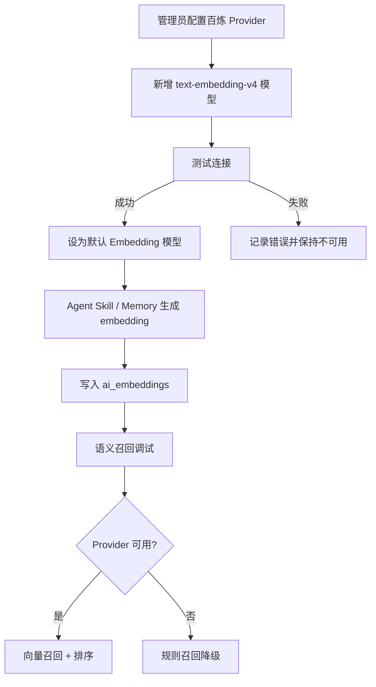

# 阿里云百炼 Embedding Provider 接入 SPEC

## 1. 背景与目标

当前系统已具备 Agent Skill 管理、语义召回调试页面、`EmbeddingService`、`ai_embeddings` 持久化表和余弦相似度检索能力，但生产初始化仍使用 `UnavailableEmbeddingProvider`。因此语义召回调试页只能显示规则回退，不能执行真实向量相似度召回。

本功能目标是接入阿里云百炼 MaaS 原生 HTTP Embedding API，默认模型为 `text-embedding-v4`，使 Agent Skill 与 AI Memory 支持真实向量化写入和语义召回，同时保留当前规则召回降级能力。

本 SPEC 只定义需求与边界，不包含代码实现。

## 2. 当前问题

1. `logic-grpc-service/service/services.go` 中 `EmbeddingService` 当前硬编码为 `UnavailableEmbeddingProvider{}`。
2. `logic-grpc-service/service/embedding_service.go` 已有 `EmbeddingProvider` 接口，但没有真实 Provider 实现。
3. `ai_embeddings` 表已存在，但缺少真实向量写入来源。
4. 语义召回调试页可以调用后端接口，但当前只能显示 provider unavailable 或规则回退。
5. Agent Skill 与 AI Memory 的 embedding 生成时机、历史数据回填、配置管理和连接测试能力尚未实现。

## 3. 功能范围

本次功能范围包括：

- 新增阿里云百炼原生 HTTP Embedding Provider 配置能力。
- 默认支持 `text-embedding-v4` 模型。
- 新增 Embedding Provider / Embedding Model 持久化配置。
- 接入 `EmbeddingService` 初始化流程。
- 支持 Agent Skill 与 AI Memory 的 embedding 写入。
- 支持历史数据 backfill。
- 支持管理端配置、连接测试和语义召回调试状态展示。
- 保留 provider 不可用时的规则召回降级。

## 4. 非目标范围

本次不做：

- 不替换现有 Agent Skill 管理业务逻辑。
- 不改变现有 `ai_embeddings` 的核心检索语义，除必要状态扩展外不重建整表。
- 不接入 OpenAI-compatible `/v1/embeddings` 作为默认实现。
- 不一次性支持所有 embedding 厂商。
- 不把 embedding model 混入现有 `llm_models` 表。
- 不要求语义召回失败时阻塞 Agent 主流程。
- 不在日志中输出简历、Memory、Skill.md 等完整敏感文本。

## 5. 用户角色与使用场景

### 用户角色

- 系统管理员：配置阿里云百炼 Embedding Provider、测试连接、设置默认模型。
- AI / Agent 管理员：维护 Agent Skill，触发 Skill embedding 更新，使用语义召回调试页验证效果。
- HR 业务用户：间接受益于更准确的 Skill 与 Memory 召回。
- 运维人员：监控 provider 调用成功率、耗时、回填任务和失败状态。

### 使用场景

1. 管理员配置阿里云百炼 endpoint、API Key 和 `text-embedding-v4`。
2. 管理员测试连接，系统返回向量维度、请求耗时和状态。
3. 管理员触发 Agent Skill 历史数据 backfill。
4. AI 管理员在语义召回调试页输入真实招聘问题，查看 Skill / Memory 召回结果。
5. Provider 异常时，系统自动降级为规则匹配并提示降级原因。

## 6. 业务流程

## 7. 功能需求

### FR-001：配置阿里云百炼 Embedding Provider

- 需求描述：系统应支持配置百炼 MaaS 原生 Embedding API endpoint 和 API Key。
- 触发条件：管理员创建或更新 Embedding Provider。
- 输入：provider name、provider_type、endpoint、API key、extra headers、enabled。
- 输出：Provider 配置保存成功，API key 加密入库。
- 边界情况：endpoint 为空、API key 为空、provider_type 不支持时应拒绝保存。

### FR-002：配置默认 Embedding Model

- 需求描述：系统应支持配置 `text-embedding-v4` 并设为默认 embedding 模型。
- 触发条件：管理员创建或更新 Embedding Model。
- 输入：provider_id、model_name、display_name、batch_size、timeout_seconds、max_retries、is_default。
- 输出：模型保存成功，默认模型唯一。
- 边界情况：provider 不存在、provider disabled、model_name 为空、多个默认模型时应保证唯一默认。

### FR-003：测试 Provider 连接

- 需求描述：系统应调用百炼 HTTP API 验证模型可用性。
- 触发条件：管理员点击测试连接。
- 输入：provider_id、model_id、测试文本。
- 输出：成功时返回向量维度、耗时、request_id；失败时返回脱敏错误。
- 边界情况：401/403 不重试；429/5xx/timeout 可重试；空向量或维度异常应视为失败。

### FR-004：服务初始化接入真实 Provider

- 需求描述：服务启动时应加载默认 embedding model 并构建真实 `BailianTextEmbeddingProvider`。
- 触发条件：logic-grpc-service 启动。
- 输入：config、数据库 provider/model、加密密钥。
- 输出：`EmbeddingService` 使用真实 provider 或降级 provider。
- 边界情况：配置缺失、解密失败、默认模型不存在时应记录 warn 并降级。

### FR-005：Agent Skill embedding 写入

- 需求描述：Agent Skill 创建、更新、版本激活后应生成 embedding。
- 触发条件：Skill 创建、元数据更新、版本激活、启用。
- 输入：Skill 元数据、trigger keywords、semantic tags、当前 SKILL.md body。
- 输出：`ai_embeddings` 中写入 object_type=`agent_skill` 的 ready 或 failed 记录。
- 边界情况：Provider 不可用时不影响 Skill 保存，记录 unavailable/failed 状态。

### FR-006：AI Memory embedding 写入

- 需求描述：AI Memory 创建或更新后应生成 embedding。
- 触发条件：Memory 创建、内容更新。
- 输入：memory content、scope_type、scope_id、memory_type、source。
- 输出：`ai_embeddings` 中写入 object_type=`ai_memory` 的记录。
- 边界情况：Memory 内容为空时跳过；Provider 不可用时不阻塞主流程。

### FR-007：历史数据 Backfill

- 需求描述：系统应支持对历史 Agent Skill 和 AI Memory 批量生成 embedding。
- 触发条件：管理员或运维执行 backfill 命令。
- 输入：object_type、limit、batch_size、force、dry_run、model_id。
- 输出：成功、失败、跳过数量统计。
- 边界情况：已有同 model + text_hash 的 ready 记录应跳过，除非 force=true。

### FR-008：语义召回调试展示 Provider 状态

- 需求描述：调试页应展示当前 provider/model、embedding 状态、降级原因、请求耗时和召回结果。
- 触发条件：用户运行语义召回测试。
- 输入：query、agent_type、job_id、application_id、limit。
- 输出：Skill / Memory 召回结果、最高分、耗时、模式状态。
- 边界情况：provider unavailable 时显示规则回退，不应显示为系统错误。

## 8. 非功能需求

### 性能要求

- 单次 query embedding 请求默认超时不超过 30s。
- Provider 并发应受 `embedding.max_concurrency` 限制，默认 8。
- Backfill 应支持 batch 和限速，避免触发 API 限流。

### 可用性要求

- Provider 不可用时系统应降级为规则召回。
- Embedding 写入失败不得影响 Skill 保存、Memory 保存或 Agent 主流程。
- 语义召回调试接口应返回可解释的 fallback reason。

### 兼容性要求

- 保持现有 `EmbeddingProvider` 接口兼容。
- 保持现有 `debugSemanticRetrieval` 前端 API 兼容，可新增字段但不得破坏旧字段。
- 不破坏现有 `ai_embeddings` 查询逻辑。

### 安全要求

- API Key 必须加密存储。
- 日志不得输出 API Key 或完整业务文本。
- Backfill 和配置接口必须要求管理员权限。
- 前端展示错误信息必须脱敏。

### 可维护性要求

- Provider 实现与 `EmbeddingService` 解耦。
- Provider factory 应支持未来扩展其他厂商。
- Backfill 与在线写入逻辑应复用统一文本构建和 embedding 写入能力。

## 9. 异常场景

- Provider 未配置：降级为规则召回，调试页提示未启用 Provider。
- API Key 错误：测试连接失败，在线流程降级。
- endpoint 错误：测试连接失败，记录连接错误。
- 429 限流：按重试策略重试，仍失败则记录 failed。
- 5xx 或 timeout：可重试，最终失败则降级。
- 返回空向量：标记模型异常，不重试。
- 维度不一致：拒绝写入 ready，记录 failed。
- Backfill 中断：已写入数据保持，后续可继续执行。

## 10. 验收标准

- AC-001：配置 `bailian_text_embedding` provider 和 `text-embedding-v4` model 后，测试连接应返回成功和向量维度。
- AC-002：默认模型启用后，logic-grpc-service 启动时不再使用 `UnavailableEmbeddingProvider`。
- AC-003：创建或激活 Agent Skill 后，应生成 object_type=`agent_skill` 的 `ai_embeddings` ready 记录。
- AC-004：创建 AI Memory 后，应生成 object_type=`ai_memory` 的 `ai_embeddings` ready 记录。
- AC-005：语义召回调试页运行测试时，provider 可用应显示 Embedding 可用和真实分数。
- AC-006：Provider 不可用时，语义召回调试页应显示规则回退，不应中断页面操作。
- AC-007：Backfill 命令应输出成功、失败、跳过统计。
- AC-008：API Key 不得明文出现在数据库、日志或前端响应中。
- AC-009：`go test ./...` 应通过。
- AC-010：`pnpm --filter hr-frontend typecheck` 应通过。

## 11. 待确认问题

- 已确认：百炼 `text-embedding-v4` 接入以用户提供的 MaaS 原生 HTTP curl 示例为准，endpoint/request body 不按 OpenAI-compatible `/v1/embeddings` 设计。
- 已确认：采用新增 `embedding_providers` 与 `embedding_models` 独立表，不复用 `llm_models`。
- 已确认：管理端配置页不纳入本期实现，但 SPEC/SDD 保留完整设计，供后续开发复用。
- 已确认：Agent Skill / AI Memory embedding 写入直接采用 MQ consumer，不使用 best-effort goroutine 作为本期方案。
- 已确认：AI Memory embedding 写入采用 Service 层发布 MQ 事件方案。Memory 创建成功、内容更新成功后，由对应业务 Service 发布 `embedding.upsert` 事件；实际向量生成和 `ai_embeddings` 写入由 MQ consumer 异步完成。
- 待确认：实现前仍需通过代码定位 AI Memory 当前实际创建/更新 Service 函数，确保所有 Memory 内容变更入口均接入事件发布。
