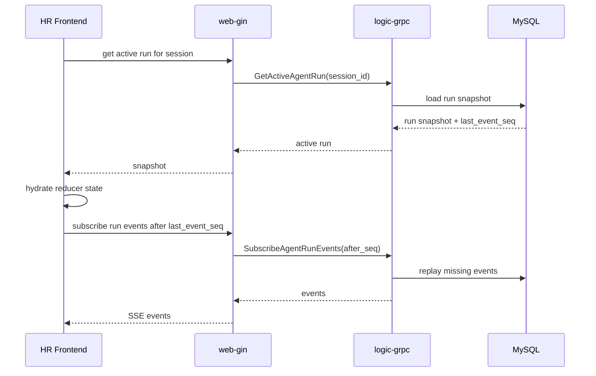

# HR Agent Resumable Stream SDD

## 1. Existing Architecture Summary

- HR frontend uses Vue 3 and stores chat page behavior in `hr-frontend/src/views/hr/AIChatView.vue`.
- HR stream API helpers live in `hr-frontend/src/api/ai.ts`, with stream-related types in `hr-frontend/src/types/ai.ts`.
- The web gateway routes HR AI HTTP/SSE requests through `web-gin-service/handler/hr/ai.go`.
- The logic service owns chat and Agent execution in `logic-grpc-service/service/ai_service.go`.
- `AgentRun` and `AgentRunStep` already exist in `logic-grpc-service/model/model.go`.
- Persistence and run recording are in `logic-grpc-service/repository/agent_run_repo.go` and `logic-grpc-service/service/agent_run_recorder.go`.
- Proto contracts are mirrored under both `logic-grpc-service/proto/` and `web-gin-service/proto/`.
- Migrations are canonical, and `db.sql` must remain aligned with schema changes.

## 2. Problem Analysis

The current stream request owns too much lifecycle. Browser refresh, tab close, route remount, or SSE disconnect can cancel the gateway request context, which cancels the logic gRPC stream and may mark an Agent run as interrupted/canceled. The frontend also repeats stream orchestration across multiple HR Agent entry points, making it hard to reason about retry, skill confirmation, process trace, and candidate analysis behavior consistently.

The durable fix is to split command, execution, persistence, and subscription concerns. A browser stream should observe a run; it should not be the run.

## 3. Proposed Design

This design turns HR Agent execution into a durable backend run and makes the browser an event subscriber. The frontend creates a run, subscribes to ordered events, and reduces those events into UI state. Refresh recovery asks the backend for the active run, hydrates from the stored snapshot, and resumes event replay from the last known sequence.

The reducer is a plain TypeScript event reducer used from Vue composables. It is not React-specific, Redux, or a required global store.

Proposed components:

- Durable run command service in logic-grpc.
- Run state machine helper with explicit transition rules.
- Run event repository with per-run sequence allocation and replay queries.
- Run snapshot writer that batches visible output and process trace updates.
- Run worker that executes AI/tool work independent of the subscription context.
- gRPC run APIs for create, get, active lookup, subscribe, cancel, and confirm.
- Gateway REST/SSE handlers for HR run commands and subscriptions.
- HR frontend API wrapper for durable runs.
- `useHrAgentRun` Vue composable that owns subscription lifecycle.
- Pure TypeScript reducer that transforms backend events into local UI state.

## 4. Data Structure Changes

Planned schema changes:

- Extend `agent_runs` with idempotency, active session, snapshot, sequence, cancellation, and confirmation fields as needed.
- Add `agent_run_events` with `id`, `run_id`, `seq`, `event_type`, `payload_json`, and timestamps.
- Add or align `ai_chat_sessions.active_run_id`.
- Add or align `ai_chat_histories.agent_run_id`.

Suggested indexes:

- Unique idempotency key on owner/session/client request id.
- Unique event sequence on `(run_id, seq)`.
- Active run lookup on session/status.
- History lookup on `agent_run_id`.

Schema, model, migration, and `db.sql` changes are a public persistence contract and require human confirmation before implementation.

## 5. API and Interface Changes

Gateway endpoints should be thin wrappers over logic-grpc:

- `POST /api/v1/hr/ai/runs`
- `GET /api/v1/hr/ai/runs/:run_id`
- `GET /api/v1/hr/ai/sessions/:session_id/active-run`
- `GET /api/v1/hr/ai/runs/:run_id/events`
- `POST /api/v1/hr/ai/runs/:run_id/cancel`
- `POST /api/v1/hr/ai/runs/:run_id/confirm`

The event endpoint uses SSE and accepts `after_seq` and `Last-Event-ID`. The gateway must not cancel backend execution when the SSE connection closes.

Proto changes must be mirrored in both services and regenerated in both generated Go packages.

## 6. Algorithm or Workflow Changes

Run states:

- `queued`
- `planning`
- `running`
- `waiting_confirmation`
- `cancel_requested`
- `succeeded`
- `partial`
- `failed`
- `canceled`

Events are ordered per run by `seq`. Representative event types include `run.created`, `run.status_changed`, `assistant.delta`, `assistant.snapshot`, `process.delta`, `process.snapshot`, `tool.started`, `tool.finished`, `confirmation.required`, `confirmation.accepted`, `run.result`, `run.error`, `run.completed`, `run.canceled`, and `run.heartbeat`.

Refresh restore flow:

Create flow accepts the command, persists or returns an idempotent run, enqueues or dispatches work, and lets the frontend subscribe separately.

Cancel is a command, not a transport side effect. Skill confirmation pauses a run in `waiting_confirmation` and resumes the same logical run after confirmation.

## 7. Configuration Design

Use existing infrastructure and configuration patterns for MySQL, RabbitMQ/Outbox, and optional Redis. Do not add new package dependencies. Any new queue name, worker timeout, event retention value, rollout flag, or global config field must be explicitly scoped in the relevant TASK and confirmed before implementation.

## 8. Compatibility Strategy

- Keep legacy chat stream endpoints and frontend compatibility during rollout.
- Introduce the durable run flow behind the HR Agent code path.
- Do not delete old stream helpers until a later confirmed TASK declares the removal.
- Keep web-gin transport-oriented and logic-grpc lifecycle-oriented.
- Preserve existing user-facing HR chat behavior.

## 9. Error Handling and Fallback Design

- Subscription disconnect closes only the subscriber.
- Explicit cancel moves a run toward `cancel_requested` and then `canceled`.
- Provider or worker interruption may mark a run `partial` or `failed` with structured error fields.
- Duplicate create/cancel/confirm/subscribe requests must be idempotent or safely rejected.
- Frontend reducer ignores stale run ids and already-applied sequence numbers.
- Failed active-run restore should surface recoverable UI state without corrupting chat history.

## 10. Observability and Debug Output Design

- Include run id, session id, HR user id, and request id in backend logs where available.
- Persist enough event/snapshot state to inspect replay and duplicate suppression.
- Store terminal error type and user-safe message.
- TASK reports must include changed files, scope results, validation commands, and knowledge impact.

## 11. Testing Strategy

- Repository/unit tests for event sequence allocation, replay after sequence, idempotent create, active-run lookup, and terminal state rules.
- Service tests for cancellation, waiting confirmation, duplicate commands, and final message persistence.
- Gateway handler tests for auth, request validation, SSE replay headers, disconnect behavior, and forwarding.
- Frontend reducer tests for deltas, snapshots, duplicate events, stale run events, terminal states, and confirmation payloads.
- Frontend composable/view tests for submit/retry/analysis/confirmation migration and refresh restore.
- End-to-end or integration-level smoke coverage for refresh while running and reconnect after missed events where existing tooling supports it.

## 12. Migration Risks

- Event volume may grow quickly; mitigate with snapshot batching and retention policy.
- Duplicate final assistant messages are possible without `agent_run_id` association; mitigate with idempotent final persistence.
- Proto and generated code can drift; mitigate by changing both proto trees and generated packages together.
- Schema/model drift can break runtime; mitigate by pairing migrations, `db.sql`, models, repositories, and tests.
- Rollout config can create split behavior; mitigate by scoping and confirming any global config changes.

## 13. Implementation Boundaries

- HR frontend changes belong under `hr-frontend/src/api`, `hr-frontend/src/types`, `hr-frontend/src/composables`, `hr-frontend/src/utils`, `hr-frontend/src/views/hr/AIChatView.vue`, and focused tests.
- Gateway changes belong under `web-gin-service/handler/hr`, `web-gin-service/router`, `web-gin-service/rpc`, and generated proto packages.
- Logic service changes belong under `logic-grpc-service/service`, `logic-grpc-service/repository`, `logic-grpc-service/model`, migrations, generated proto packages, and focused tests.
- Do not modify candidate or interviewer frontends.
- Do not modify package manifests or lockfiles.

## 14. Alternatives Considered

- Frontend-only session storage: rejected because backend execution is still canceled on disconnect.
- Direct SSE reconnect to the old stream: rejected because the old request context owns execution.
- In-memory goroutine state only: rejected because refresh and process restart need durable recovery semantics.
- Redis Pub/Sub as source of truth: rejected because MySQL must remain the durable source of truth.
- Redux/Pinia/global store: rejected for the initial design because a local Vue composable plus pure reducer is sufficient and lower scope.

## 15. Assumptions Requiring Confirmation

- A-001: The feature is limited to HR frontend Agent assistant flows.
- A-002: One active run per chat session is sufficient.
- A-003: Skill confirmation should resume the same logical run.
- A-004: MySQL remains source of truth; RabbitMQ/Outbox dispatches durable work where needed.
- A-005: Legacy stream APIs remain during rollout.
- A-006: Exact continuation across provider or logic-service crash is out of scope.

## 16. Open Questions

- OQ-001: What retention period should apply to detailed run events after a run reaches a terminal state?
- OQ-002: Should multiple browser tabs share cancel/confirmation controls?
- OQ-003: Should rollout be guarded by an existing feature flag/config mechanism or enabled directly after validation?
- OQ-004: Should process trace replay expose exactly the same detail as the current live trace for all HR users?
