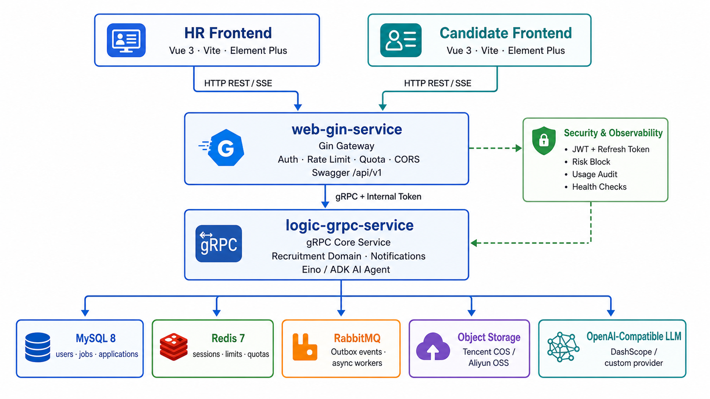
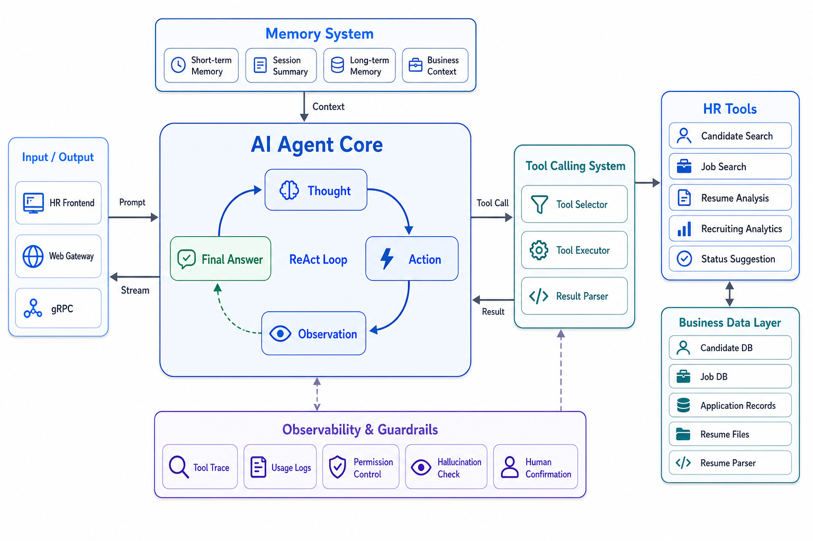

<p align="center">
  <h1 align="center">Smart Recruit</h1>
  <p align="center">基于 Go gRPC 微服务与 Vue 3 的智能招聘平台，集成 Eino/ADK AI Agent、通知、审计与对象存储能力</p>
</p>

<p align="center">
  
  
  
  
</p>

---

## 功能特性

**HR 管理端**
- 岗位发布与管理，支持部门、地点多维分类
- 候选人台账，投递全流程跟踪与状态更新
- AI 数据助手：自然语言查询招聘数据，支持流式对话、多会话管理和投递分析
- 数据看板：招聘漏斗、岗位统计等图表可视化
- 管理员能力：邀请码、部门、地点、部门地点关系维护
- 第三方/AI 调用审计，辅助观察模型与外部服务使用情况

**候选人端**
- 岗位浏览与搜索，查看职位详情
- 个人档案管理，简历上传（PDF / DOCX）与投递前置校验
- 投递状态实时追踪
- AI 求职助手：支持会话列表、流式问答与上下文记忆

**平台能力**
- JWT + Refresh Token 身份认证，支持 Cookie 隔离与角色鉴权（Candidate / HR / Admin）
- Web 网关与 Logic 服务之间支持内部 gRPC Token 鉴权
- 简历文件通过预签名 URL 直传对象存储，支持腾讯云 COS / 阿里云 OSS
- 事务消息 Outbox 模式保证通知投递可靠性
- Redis 限流、AI 日配额、简历上传配额、风险阻断与安全响应头
- Docker Compose 一键部署，含前后端及全部中间件

## 系统架构





- **Web 层**（Gin）：处理 HTTP API、鉴权、限流、请求体限制、SSE 流式响应和 HTTP → gRPC 转换
- **Logic 层**（gRPC）：承载核心业务逻辑，通过 Eino/ADK Agent 编排招聘工具调用
- **消息队列**：事务 Outbox 模式保障通知可靠投递，简历解析异步化
- **文件存储**：私有 Bucket + 预签名 URL 直传，支持腾讯云 COS 与阿里云 OSS
- **安全治理**：Refresh Token、内部 gRPC 鉴权、Redis 限流、AI 配额和第三方调用审计

## 技术栈

| 层次 | 技术选型 |
|------|----------|
| HR 前端 | Vue 3 + Vite + Pinia + Element Plus + ECharts |
| 用户前端 | Vue 3 + Vite + Pinia + Element Plus |
| Web 网关 | Go + Gin + JWT + Redis Rate Limit |
| 业务服务 | Go + gRPC + Protobuf + GORM |
| AI 框架 | CloudWeGo Eino + ADK-style Agent Runtime |
| 数据库 | MySQL 8.x |
| 缓存 | Redis 7 |
| 消息队列 | RabbitMQ |
| 对象存储 | 腾讯云 COS / 阿里云 OSS |
| 容器化 | Docker + Docker Compose |

## 快速开始

### 前置条件

- **Docker Compose**（推荐）：Docker >= 20.10，docker-compose >= 2.0
- **本地开发**：Go >= 1.25，Node.js >= 18，pnpm，MySQL 8.0，Redis 7，RabbitMQ 3.x

### Docker Compose 部署（推荐）

```bash
# 1. 克隆项目
git clone https://github.com/your-username/smart-recruit.git
cd smart-recruit

# 2. 配置密钥
cp docker/.env.example docker/.env
# 编辑 docker/.env，填写 GRPC_INTERNAL_TOKEN、JWT_SECRET、AI API Key 和 OSS/COS 密钥

# 3. 一键启动
cd docker
docker-compose up -d --build
```

首次构建约 3-5 分钟，启动后访问：

| 服务 | 地址 |
|------|------|
| HR 管理端 | http://localhost:5173 |
| 候选人用户端 | http://localhost:5174 |
| Web API | http://localhost:8080 |
| Swagger | http://localhost:8080/swagger/index.html |
| RabbitMQ 管理 | http://localhost:15672 |

### 本地开发

```bash
# 1. 初始化数据库
mysql -u root -p < db.sql

# 2. 配置 Logic 服务
cp logic-grpc-service/config/config.example.yaml logic-grpc-service/config/config.yaml
# 编辑 config.yaml，填写 MySQL DSN、Redis、RabbitMQ、OSS/COS、JWT 和 AI 配置

# 3. 启动 Logic gRPC 服务（必须先启动）
cd logic-grpc-service
go mod tidy
go run main.go
# 监听 :50051

# 4. 启动 Web Gin 服务
cd web-gin-service
go mod tidy
go run main.go
# 监听 :8080

# 5. 启动前端
cd hr-frontend && pnpm install && pnpm run dev   # → localhost:5173
cd user-frontend && pnpm install && pnpm run dev  # → localhost:5174
```

## 项目结构

```
smart-recruit/
├── hr-frontend/                # HR 管理端前端 (Vue 3 + Element Plus)
│   └── src/
│       ├── api/                # API 请求层
│       ├── components/         # 通用组件
│       ├── views/hr/           # HR 页面（工作台、岗位管理、AI 对话等）
│       ├── stores/             # Pinia 状态管理
│       └── router/             # 路由定义
├── user-frontend/              # 候选人用户端前端 (Vue 3 + Element Plus)
│   └── src/
│       ├── api/                # API 请求层
│       ├── views/candidate/    # 候选人页面（岗位列表、投递、简历等）
│       └── ...
├── web-gin-service/            # Gin Web 网关服务
│   ├── handler/                # HTTP 处理器（candidate / hr 分组）
│   ├── middleware/             # JWT、限流、配额、CSP 等中间件
│   ├── pkg/                    # 网关通用包
│   ├── router/                 # 路由注册
│   └── rpc/                    # gRPC 客户端连接
├── logic-grpc-service/         # 核心业务 gRPC 服务
│   ├── ai/                     # Eino/ADK Agent、工具、重试、熔断与预算控制
│   ├── service/                # 业务逻辑层
│   ├── repository/             # 数据访问层
│   ├── model/                  # 数据模型
│   ├── migrations/             # 数据库迁移脚本
│   ├── mq/                     # RabbitMQ 发布/消费
│   ├── oss/                    # 腾讯云 COS / 阿里云 OSS 客户端
│   ├── pkg/                    # Logic 通用包
│   └── proto/                  # Protobuf 定义
├── packages/                   # 前端共享工具包
├── docker/                     # Dockerfiles 与 Compose 编排
├── deploy/k8s/                 # Kubernetes 部署清单
├── pnpm-workspace.yaml         # 前端 workspace 配置
└── db.sql                      # 数据库初始化脚本
```

## 配置说明

所有密钥通过配置文件注入，已加入 `.gitignore`，不会提交到仓库：

| 配置文件 | 用途 |
|----------|------|
| `logic-grpc-service/config/config.yaml` | 本地运行 Logic 服务的 MySQL / Redis / RabbitMQ / OSS / AI / JWT 配置 |
| `docker/.env` | Docker Compose 环境变量，包含内部 gRPC Token、JWT、AI 与对象存储密钥 |

**对象存储配置要点**：Bucket 建议私有读写，关闭公开访问，CORS 配置允许前端直传。`OSS_PROVIDER` 可设置为 `tencent_cos` 或 `aliyun_oss`。

**AI 配置**：默认使用阿里云百炼兼容 OpenAI 接口，可替换为任意 OpenAI 兼容服务。`AI_AGENT_RUNTIME` 支持 `adk` 和 `legacy`。

```yaml
ai:
  api_key: "sk-xxx"
  model: "qwen-plus"
  base_url: "https://dashscope.aliyuncs.com/compatible-mode/v1"
  agent_runtime: "adk"
  timeout: "90s"
```

**安全配置**：生产环境请务必设置强随机 `JWT_SECRET` 和 `GRPC_INTERNAL_TOKEN`，并在 HTTPS 环境下开启 `AUTH_COOKIE_SECURE=true`。

## API 文档

启动 Web 服务后访问 Swagger UI：

```text
http://localhost:8080/swagger/index.html
```

## 贡献指南

1. Fork 本仓库
2. 创建特性分支：`git checkout -b feature/amazing-feature`
3. 提交代码：`git commit -m 'feat: add amazing feature'`
4. 推送到远端：`git push origin feature/amazing-feature`
5. 提交 Pull Request

提交信息请遵循 [Conventional Commits](https://www.conventionalcommits.org/) 规范。

## 许可证

本项目基于 MIT 许可证开源。
