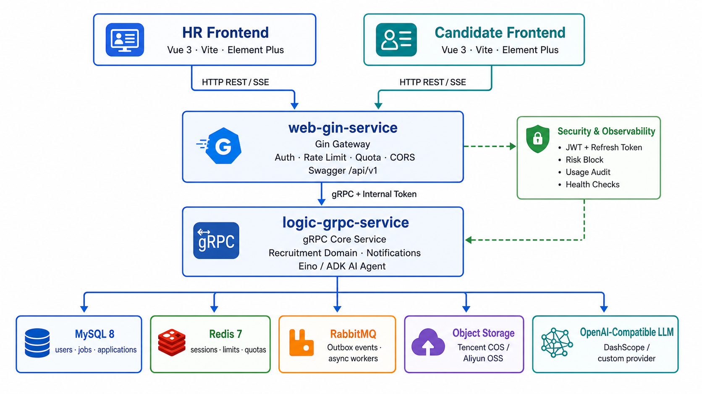
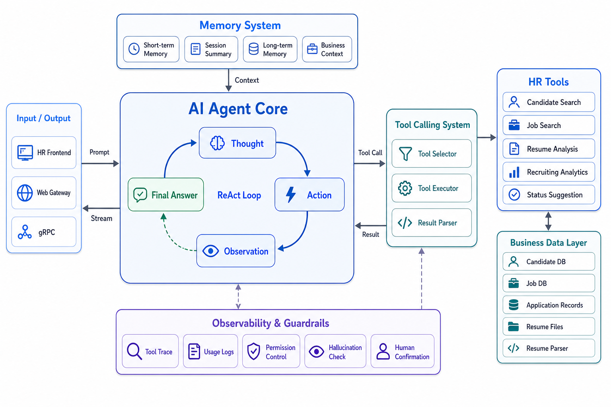

<p align="center">
  <h1 align="center">Smart Recruit</h1>
  <p align="center">基于 Go gRPC 微服务与 Vue 3 的智能招聘平台，集成 Eino/ADK AI Agent、RBAC 权限、面试管理、Offer 全流程、协作与审计能力</p>
  <p align="center"><a href="https://recruit.jkghjk123.site">访问项目主页</a></p>
</p>

<p align="center">
  
  
  
  
</p>

---

## 功能特性

**HR 管理端**
- 工作台：招聘数据概览、关键指标统计
- 岗位发布与管理，支持部门、地点多维分类与上下线控制
- 候选人台账：投递全流程跟踪、状态机驱动的流转管理（VIEWED → INTERVIEW_PENDING → INTERVIEW_PASSED → OFFER_PENDING 等）
- 候选人详情页：简历查看、内部备注、标签管理、跟进任务、操作时间线
- 面试管理：安排面试（支持多轮）、面试详情查看、面试反馈收集
- Offer 管理：创建、编辑、发送、撤回，候选人接受/拒绝全生命周期跟踪
- AI 数据助手：自然语言查询招聘数据，支持流式对话、多会话管理、投递分析与候选人 AI 评估
- 数据分析：招聘漏斗、岗位停留时长、面试与 Offer 指标等图表可视化
- 通知系统：SSE 实时推送、未读计数、批量已读标记
- 管理员能力：邀请码管理、部门/地点分类维护、员工账号管理、RBAC 角色与权限分配、数据权限控制
- 第三方/AI 调用审计与安全鉴权审计，辅助观察模型与外部服务使用情况

**企业招聘工作台中的面试官工作区**
- 面试官与招聘团队共用企业成员登录和租户会话
- “我的面试”仅展示当前企业分配的任务、候选人材料和面试安排
- 面试反馈由 `interview.read` 与 `interview.feedback.submit` 权限控制，不再维护独立面试官身份域

**平台运营控制台**
- 独立 `platform` 应用准入，仅允许平台管理员访问
- 企业租户创建、状态管理和成员归属审查
- 平台身份不携带企业租户上下文，避免与企业管理员权限混用

**候选人端**
- 岗位浏览与搜索，查看职位详情
- 个人档案管理，简历上传（PDF / DOCX）与投递前置校验
- 投递状态实时追踪
- 我的面试：查看已安排的面试信息
- 我的 Offer：查看、接受、拒绝 Offer
- AI 求职助手：支持会话列表、流式问答与上下文记忆
- 通知系统：SSE 实时推送与未读管理

**平台能力**
- JWT + Refresh Token 身份认证，支持 Cookie 隔离与基于 RBAC 的细粒度权限鉴权（Candidate / Recruiter / Recruiting Admin / System Admin / Interviewer）
- HTTP Gateway 与后端微服务之间支持内部 gRPC Token 鉴权
- 权限审计日志：记录每次鉴权决策（allow / deny），支持安全审计查询
- 简历文件通过预签名 URL 直传对象存储，支持腾讯云 COS / 阿里云 OSS
- 事务消息 Outbox 模式保证通知投递可靠性
- Redis 限流、AI 日配额、简历上传配额、风险阻断与安全响应头
- Docker Compose 一键部署，含前后端及全部中间件

## 系统架构





- **Gateway 层**（Gin）：处理 HTTP API、RBAC 权限校验、限流、请求体限制、SSE 流式响应和 HTTP → gRPC 转换
- **后端微服务层**（gRPC）：Identity、Recruitment、Interview、Offer、Notification、AI Agent、Analytics、Worker 独立构建和启动，共享 protobuf、platform 与 domain 模块
- **消息队列**：事务 Outbox 模式保障通知可靠投递，简历解析异步化
- **文件存储**：私有 Bucket + 预签名 URL 直传，支持腾讯云 COS 与阿里云 OSS
- **安全治理**：Refresh Token、RBAC 细粒度权限、权限审计日志、内部 gRPC 鉴权、Redis 限流、AI 配额和第三方调用审计

## 技术栈

| 层次 | 技术选型 |
|------|----------|
| HR 前端 | Vue 3 + Vite + Pinia + Element Plus + ECharts + WangEditor |
| 候选人前端 | Vue 3 + Vite + Pinia + Element Plus |
| 面试官前端 | Vue 3 + Vite + Pinia + Element Plus |
| Web 网关 | Go + Gin + JWT + Redis Rate Limit + Swagger |
| 业务服务 | Go + gRPC + Protobuf + GORM |
| AI 框架 | CloudWeGo Eino + ADK-style Agent Runtime |
| 数据库 | MySQL 8.x |
| 缓存 | Redis 7 |
| 消息队列 | RabbitMQ |
| 对象存储 | 腾讯云 COS / 阿里云 OSS |
| 容器化 | Docker + Docker Compose |
| 编排 | Kubernetes（可选） |

## 快速开始

### 前置条件

- **Docker Compose**（推荐）：Docker >= 20.10，docker-compose >= 2.0
- **本地开发**：Go >= 1.25，Node.js >= 18，pnpm，MySQL 8.0，Redis 7，RabbitMQ 3.x

### Docker Compose 部署（推荐）

```bash
# 1. 克隆项目
git clone https://github.com/your-username/smart-recruit.git
cd smart-recruit

# 2. 配置密钥
cp docker/.env.example docker/.env
# 编辑 docker/.env，填写 GRPC_INTERNAL_TOKEN、JWT_SECRET、AI API Key 和 OSS/COS 密钥

# 3. 一键启动
cd docker
docker-compose up -d --build
```

首次构建约 3-5 分钟，启动后访问：

| 服务 | 地址 |
|------|------|
| 企业招聘工作台 | http://localhost:5173 |
| 候选人门户 | http://localhost:5174 |
| 平台运营控制台 | http://localhost:5175 |
| Web API | http://localhost:8080 |
| Swagger | http://localhost:8080/swagger/index.html |
| RabbitMQ 管理 | http://localhost:15672 |

### 本地开发

```bash
# 1. 启动基础服务（MySQL、Redis、RabbitMQ）
cd docker && docker compose up -d mysql redis rabbitmq && cd ..
# 也可以使用本机已安装的 MySQL / Redis / RabbitMQ

# 2. 启动新微服务后端和前端
export TZ='Asia/Shanghai'
export MYSQL_DSN='root:password@tcp(127.0.0.1:3306)/recruitment?charset=utf8mb4&parseTime=true&loc=Asia%2FShanghai&time_zone=%27%2B08%3A00%27'
export JWT_SECRET='dev-jwt-secret-at-least-32-chars-long!!'
export GRPC_INTERNAL_TOKEN='local-dev-internal-token-at-least-32!!'
./start-dev.sh
```

项目主页可独立开发与验证：

```bash
pnpm --filter homepage dev
pnpm --filter homepage typecheck
pnpm --filter homepage test
pnpm --filter homepage build
```

## 项目结构

```
smart-recruit/
├── homepage/                   # 公开项目主页，通过 GitHub Pages 发布
├── hr-frontend/                # 企业招聘工作台：招聘专员、招聘管理员、面试官
│   └── src/
│       ├── api/                # API 请求层
│       ├── components/         # 通用组件
│       ├── views/hr/           # HR 页面（工作台、岗位、候选人、面试、Offer、AI、数据分析等）
│       ├── stores/             # Pinia 状态管理
│       └── router/             # 路由定义（含 RBAC 权限守卫）
├── user-frontend/              # 候选人门户 (Vue 3 + Element Plus)
│   └── src/
│       ├── api/                # API 请求层
│       ├── views/candidate/    # 候选人页面（岗位列表、投递、简历、面试、Offer 等）
│       └── ...
├── platform-frontend/          # 平台运营控制台，仅允许平台管理员准入
│   └── src/
│       ├── api/                # API 请求层
│       ├── views/              # 企业租户与平台治理页面
│       └── ...
├── smart-recruit-gateway/      # Gin HTTP Gateway，承接 HTTP 路由、middleware、handler、gRPC clients
├── smart-recruit-identity-service/
├── smart-recruit-recruitment-service/
├── smart-recruit-interview-service/
├── smart-recruit-offer-service/
├── smart-recruit-notification-service/
├── smart-recruit-ai-agent-service/
├── smart-recruit-analytics-service/
├── smart-recruit-billing-service/  # 账单、积分、支付与 AI 用量结算
├── smart-recruit-worker-service/
├── smart-recruit-commons/    # 领域服务、repository、model、migration、mq、oss、ai、email
├── smart-recruit-platform-go/  # Nacos、配置、日志、健康检查、metrics、trace、gRPC runtime helper
├── smart-recruit-proto/        # 唯一 protobuf 源码根与生成代码
├── packages/                   # 前端共享工具包
├── docker/                     # Dockerfiles 与 Compose 编排
├── deploy/k8s/                 # Kubernetes 部署清单
└── pnpm-workspace.yaml         # 前端 workspace 配置
```

## 配置说明

所有密钥通过配置文件注入，已加入 `.gitignore`，不会提交到仓库：

| 配置文件 | 用途 |
|----------|------|
| `smart-recruit-commons/config/config.example.yaml` | 本地运行后端微服务的 MySQL / Redis / RabbitMQ / OSS / AI / JWT 配置模板 |
| `docker/.env` | Docker Compose 环境变量，包含内部 gRPC Token、JWT、AI 与对象存储密钥 |

**对象存储配置要点**：Bucket 建议私有读写，关闭公开访问，CORS 配置允许前端直传。`OSS_PROVIDER` 可设置为 `tencent_cos` 或 `aliyun_oss`。

**RBAC 权限体系**：系统内置 5 个角色（Candidate、Recruiter、Recruiting Admin、System Admin、Interviewer），通过 `roles` / `permissions` / `role_permissions` / `user_roles` 表实现细粒度权限控制，支持数据权限（data scopes）隔离。管理员可在 HR 端「员工账号管理」中分配角色与数据权限。

**AI 配置**：默认使用阿里云百炼兼容 OpenAI 接口，可替换为任意 OpenAI 兼容服务。`AI_AGENT_RUNTIME` 支持 `adk` 和 `legacy`。

```yaml
ai:
  api_key: "sk-xxx"
  model: "qwen-plus"
  base_url: "https://dashscope.aliyuncs.com/compatible-mode/v1"
  agent_runtime: "adk"
  timeout: "90s"
```

**安全配置**：生产环境请务必设置强随机 `JWT_SECRET` 和 `GRPC_INTERNAL_TOKEN`，并在 HTTPS 环境下开启 `AUTH_COOKIE_SECURE=true`。三端（候选人、HR、面试官）使用独立 Cookie 名称实现隔离。

## API 文档

启动 Gateway 后访问 Swagger UI：

```text
http://localhost:8080/swagger/index.html
```

## 贡献指南

1. Fork 本仓库
2. 创建特性分支：`git checkout -b feature/amazing-feature`
3. 提交代码：`git commit -m 'feat: add amazing feature'`
4. 推送到远端：`git push origin feature/amazing-feature`
5. 提交 Pull Request

提交信息请遵循 [Conventional Commits](https://www.conventionalcommits.org/) 规范。

## 许可证

本项目基于 MIT 许可证开源。
